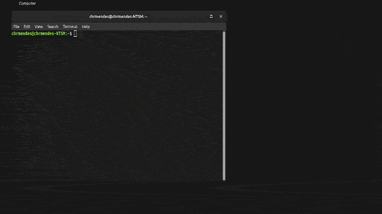
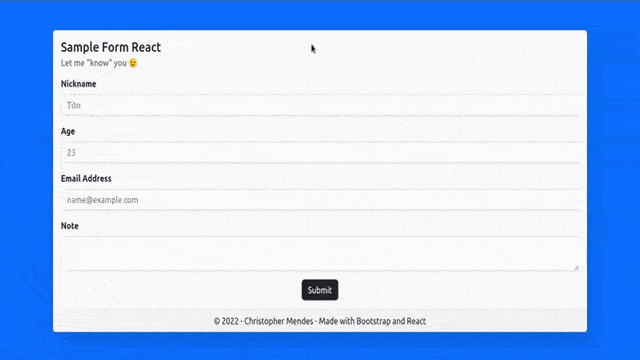

# Overview

Welcome to my basic sample form coded with ReactJS and use of Bootstrap! Additionally, I am using Conventional Commits for each commit.

I created this repository to demonstrate how ReactJS is powerful and simple. Also I plan to add features and colaborate with others as needed to improve this sample.

### Getting Started:

1. Follow the **Getting Started** step-by-setp of the [react_form_integration](https://github.com/bos21001/sample_form_integration#getting-started) repository:


2. Clone the repository in the same directory as **laradock** and **sample_form_integration** directories are:

    ```
    git clone https://github.com/bos21001/sample_form_react.git
    ```

3. Install the dependencies:
    
    ```
    cd sample_form_react
    ```

    ```
    npm install
    ```

4. Run the app in the development mode:
    
    ```
    npm start
    ```
>Open [http://localhost:3000](http://localhost:3000) (sometimes it changes depending on your port 3000 is in use) to view it in your browser.




#### Watch the software demo bellow:
[Software Demo Video](https://youtu.be/Nm9xekdtJ4I)

# Web Pages

There are two pages within it. The `index` page displays the form itself and 4 for different inputs. This form is dynamically created by a function called Form. It makes life easier to create custom input fields.\
The submit button in this page takes all the inputs and send to the `submitted` page to be displayed to the user what have been sent.



# Development Environment

- Frameworks:
  - ReactJS v18.2.0
  - Bootstrap v5.2
- Library
  - react-router-dom v6.4

# Useful Websites

* [React](https://reactjs.org/)
* [react-router-dom](https://github.com/remix-run/react-router/tree/main/packages/react-router-dom)
* [Bootstrap](https://getbootstrap.com/)
* [Conventional Commits](https://www.conventionalcommits.org/en/v1.0.0/)
* This project was bootstrapped with [Create React App](https://github.com/facebook/create-react-app).

# Future Work

* Alocate the data in a simple database consuming an api
* Allow the update and to delete the note
* Redirect the user to index when attempt to go on `page.local/submitted`